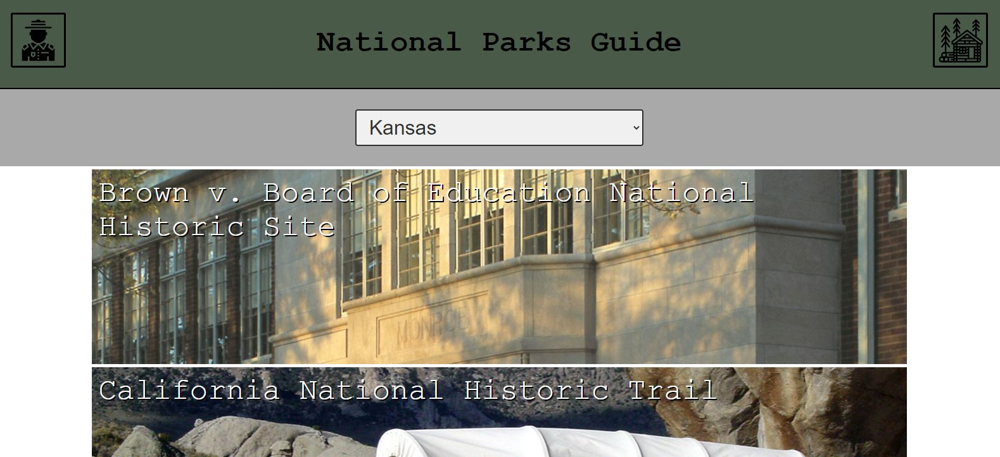
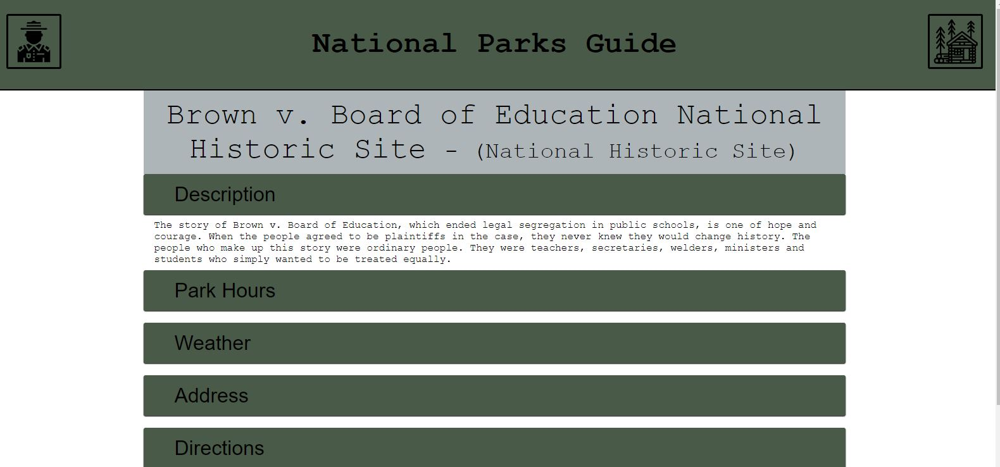
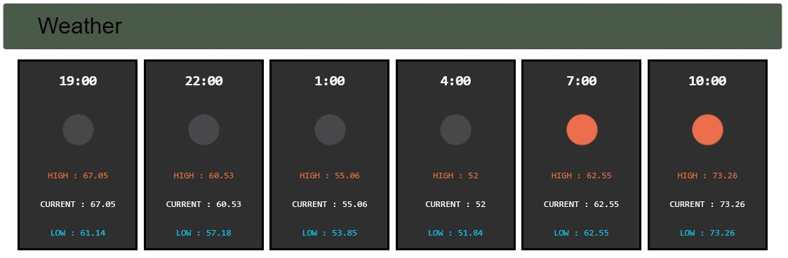

# National Parks Guide App
This project's goal was to create a companinon app for anyone looking to learn about, or explore the National Parks in the United States. On the homepage there is a drop down that allows users to filter for parks by state. Once a state is selected, images from each of the parks appear on the page and are clickable images to load the page:

Figure 1: Homepage with Kansas selected as the main state.
 

## Parks Pages
Each park page is comprised of a number of collapsible sections containing information on general descriptions, location, directions and even an 18 hour weather forecast for the city the park is nearest. 

Figure 2: Overview of what each park page looks like

 
 

Figure 3: Image of the Weather Forecast widget on each page

## Tools Behind the App
This app was created using React with React Routers for the routing. The two APIs used in this project were the NPS API for the national parks information and OpeanWeatherMap API for the weather information. The app is responsive to look crisp and clear for any device from a desktop down to an iPhone 5. Testing was done on the design's responsiveness, the passed data through use of the prop-types package and by testing for general edge cases. This app is deployed on heroku at: https://nationalparksapp.herokuapp.com/ 

